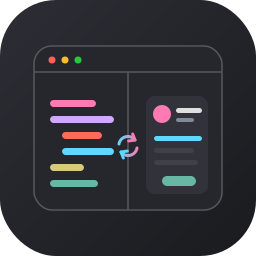
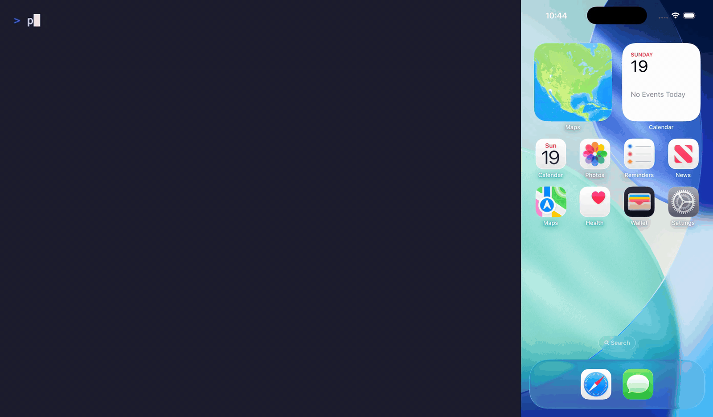

<p align="center">
  
</p>

<h1 align="center">PreviewsMCP</h1>

<p align="center">
  A standalone SwiftUI preview host for humans and AI agents.<br>
  Run, snapshot, and interact with <code>#Preview</code> blocks from the command line or over <a href="https://modelcontextprotocol.io/">MCP</a> — no Xcode process required.
</p>

<p align="center">
  
</p>

## Quickstart

```bash
git clone https://github.com/obj-p/PreviewsMCP.git
cd PreviewsMCP
swift run previewsmcp examples/spm/Sources/ToDo/ToDoView.swift
```

A live macOS preview window opens. Edit the source file and the window hot-reloads.

## Why PreviewsMCP?

Xcode previews run in a sandboxed process with no app lifecycle — no `UIApplicationDelegate`, no `didBecomeActive`, no real `UIApplication`. This means Firebase, analytics, auth, and custom fonts crash or silently break. The ecosystem answer is "mock everything," and at scale teams maintain **micro apps** — standalone app targets that render a single feature with controlled dependencies. Airbnb's dev apps drive over 50% of local iOS builds. Point-Free's isowords has 9 preview apps. Every team pays the maintenance tax: separate targets, schemes, and mock setups that drift.

PreviewsMCP eliminates this tradeoff. It compiles your `#Preview` closure into a dylib and loads it into a real app process (macOS `NSApplication` or iOS simulator `UIApplication`) with hot-reload. Firebase, auth, fonts, and DI containers just work — because there's a real app lifecycle.

The [setup plugin](Sources/PreviewsSetupKit/PreviewSetup.swift) completes the picture: a `PreviewSetup` protocol where `setUp()` runs once per session (SDK init, auth, DI registration) and `wrap()` surrounds every preview (themes, environment values). It's the micro app's dependency layer extracted into a reusable framework — without maintaining a separate app target.

Works with **SPM**, **Xcode projects** (`.xcodeproj` / `.xcworkspace`), and **Bazel**.

## Installation

### Homebrew

```bash
brew tap obj-p/tap
brew install previewsmcp
```

### From source

```bash
git clone https://github.com/obj-p/PreviewsMCP.git
cd PreviewsMCP
swift build -c release
```

The binary is at `.build/release/previewsmcp`.

### Requirements

- macOS 14+
- Xcode 16+ (for iOS simulator support)
- Apple Silicon

## Capabilities

- **Live previews** — hot-reload SwiftUI on macOS or a real iOS simulator, preserving `@State` where it can.
- **Variant & trait sweeps** — render one preview across many trait combinations (`colorScheme`, `dynamicTypeSize`, `locale`, `layoutDirection`, `legibilityWeight`) in a single call, with presets for light/dark, `xSmall`–`accessibility5`, `rtl`, `ltr`, and `boldText`.
- **Multi-preview selection** — `#Preview` macros and legacy `PreviewProvider`, with mid-session switching.
- **iOS interaction** — walk the accessibility tree and inject taps/swipes through an in-simulator touch bridge.
- **Setup plugin** — one-time SDK init, auth, and DI registration via `setUp()`, per-render theme/environment wrapping via `wrap()`.
- **Project config** — `.previewsmcp.json` for per-project defaults (platform, device, traits, quality, setup target).

## Usage

### CLI

```bash
previewsmcp help                   # top-level overview
previewsmcp help <subcommand>      # full options for run / snapshot / variants / list / serve
```

A few common invocations:

```bash
previewsmcp MyView.swift                           # live macOS preview window
previewsmcp MyView.swift --platform ios            # iOS simulator
previewsmcp snapshot MyView.swift -o preview.png   # one-shot screenshot
previewsmcp list MyView.swift                      # enumerate #Preview blocks
```

Drop a `.previewsmcp.json` at your project root to set defaults for every CLI command and MCP tool call (see [`examples/.previewsmcp.json`](examples/.previewsmcp.json) for the canonical shape):

```json
{
  "platform": "ios",
  "device": "iPhone 16 Pro",
  "traits": { "colorScheme": "dark", "locale": "en" }
}
```

Explicit CLI/MCP parameters override config values. The config is auto-discovered by walking up from the source file directory.

### MCP server

Add to your agent's MCP config — same `mcpServers` shape whether it lands in `.mcp.json` (Claude Code), `~/.cursor/mcp.json` (Cursor), `.vscode/mcp.json` (VS Code), or `claude_desktop_config.json` (Claude Desktop):

```json
{
  "mcpServers": {
    "previews": {
      "command": "/path/to/previewsmcp",
      "args": ["serve"]
    }
  }
}
```

Once connected, ask your agent *"what `previews` tools are available?"* — it will describe them directly from the server's registered schemas, including snapshotting, variant capture, accessibility-tree inspection, and touch injection.


