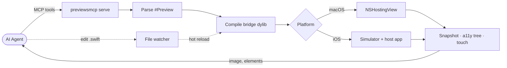

<p align="center">
  
</p>

<h1 align="center">PreviewsMCP</h1>

<p align="center">
  Render and interact with SwiftUI previews outside of Xcode.<br>
  Works as a CLI tool and as an <a href="https://modelcontextprotocol.io/">MCP server</a> for AI-driven UI development.
</p>

<p align="center">
  
</p>

<p align="center"><em>Edit a SwiftUI source file — the iOS simulator hot-reloads live. No Xcode.</em></p>


## How it works



The agent drives the loop: call an MCP tool, get a snapshot or accessibility tree back, edit code, and the file watcher triggers a hot reload that preserves `@State` where possible. No Xcode needed.

## Installation

### Homebrew

```bash
brew tap obj-p/tap
brew install previewsmcp
```

### From source

```bash
git clone https://github.com/obj-p/PreviewsMCP.git
cd PreviewsMCP
swift build -c release
```

The binary is at `.build/release/previewsmcp`.

### Requirements

- macOS 14+
- Xcode 16+ (for iOS simulator support)
- Apple Silicon

## CLI Usage

```bash
# List previews in a file (#Preview macros and PreviewProvider)
previewsmcp list MyView.swift

# Run a live preview window (macOS)
previewsmcp run MyView.swift

# Run a specific preview (0-based index)
previewsmcp run MyView.swift --preview 1

# Run on iOS simulator (Simulator.app window visible by default)
previewsmcp run MyView.swift --platform ios

# Run iOS preview headless (hide Simulator.app GUI)
previewsmcp run MyView.swift --platform ios --headless

# Specify project root for Xcode/Bazel projects
previewsmcp run MyView.swift --project ./MyApp

# Render with trait overrides
previewsmcp run MyView.swift --color-scheme dark --dynamic-type-size accessibility3

# Localization and accessibility traits
previewsmcp run MyView.swift --locale ar --layout-direction rightToLeft
previewsmcp run MyView.swift --legibility-weight bold

# Capture a screenshot (JPEG by default, .png for PNG)
previewsmcp snapshot MyView.swift -o preview.png

# Snapshot a specific preview with traits
previewsmcp snapshot MyView.swift --preview 1 --color-scheme dark -o dark.jpg

# Snapshot on iOS simulator
previewsmcp snapshot MyView.swift --platform ios -o ios_preview.png

# Capture multiple trait variants in one run (creates one image per variant)
previewsmcp variants MyView.swift --variant light --variant dark --variant rtl -o snapshots/

# Custom variants with JSON object strings (label sets the output filename)
previewsmcp variants MyView.swift \
  --variant '{"colorScheme":"dark","locale":"ar","layoutDirection":"rightToLeft","label":"dark-arabic"}' \
  --variant '{"colorScheme":"light","dynamicTypeSize":"xSmall","label":"light-xSmall"}' \
  --platform ios -o snapshots/

# Use a project config file for defaults (auto-discovered or explicit)
previewsmcp run MyView.swift --config .previewsmcp.json
```

Supports both `#Preview` macros and the legacy `PreviewProvider` protocol — `list` shows all previews from both, and `run`/`snapshot` can render any by index.

## MCP Server

Add to your `.mcp.json` (or Claude Code MCP config):

```json
{
  "mcpServers": {
    "previews": {
      "command": "/path/to/previewsmcp",
      "args": ["serve"]
    }
  }
}
```

### Tools

| Tool | Description |
|---|---|
| `preview_list` | List `#Preview` blocks and `PreviewProvider` previews in a Swift file |
| `preview_start` | Compile and launch a live preview (macOS or iOS simulator). Returns a session ID |
| `preview_snapshot` | Capture a screenshot of the active session (JPEG by default; `quality: 1.0` for PNG) |
| `preview_configure` | Update traits (`colorScheme`, `dynamicTypeSize`, `locale`, `layoutDirection`, `legibilityWeight`) on a running session |
| `preview_switch` | Swap to a different `#Preview` index without tearing down the session |
| `preview_variants` | Capture screenshots under multiple trait configurations in one call |
| `preview_elements` | Inspect the accessibility tree of an iOS preview |
| `preview_touch` | Send a tap or swipe to an iOS preview |
| `preview_stop` | Close a session |
| `simulator_list` | List available iOS simulator devices |

### Capturing variants

`preview_variants` captures multiple snapshots in a single call — useful for comparing light/dark mode, dynamic type sizes, or custom trait combinations. Each variant triggers a recompile, and the session's original traits are restored afterward.

Pass an array of preset names or JSON object strings as the `variants` argument:

```jsonc
// Preset names — light/dark, xSmall through accessibility5, rtl, ltr, boldText
{
  "sessionID": "...",
  "variants": ["light", "dark", "rtl", "boldText"]
}

// Custom combinations via JSON object strings
{
  "sessionID": "...",
  "variants": [
    "{\"colorScheme\":\"dark\",\"locale\":\"ar\",\"layoutDirection\":\"rightToLeft\",\"label\":\"dark-arabic\"}",
    "{\"colorScheme\":\"light\",\"dynamicTypeSize\":\"xSmall\",\"label\":\"light+xSmall\"}"
  ]
}
```

The response contains one labeled image per variant.

### Project config

Create a `.previewsmcp.json` in your project root to set defaults for all CLI commands and MCP tool calls:

```json
{
  "platform": "ios",
  "device": "iPhone 16 Pro",
  "traits": {
    "colorScheme": "dark",
    "locale": "en"
  },
  "quality": 0.9,
  "setup": {
    "moduleName": "MyAppPreviewSetup",
    "typeName": "AppPreviewSetup",
    "packagePath": "PreviewSetup"
  }
}
```

All fields are optional. Explicit CLI/MCP parameters override config values. The config is auto-discovered by walking up from the source file directory.

### Setup plugin

`PreviewsSetupKit` provides a protocol for app-level initialization and view wrapping — replacing micro apps / dev apps that teams maintain for isolated feature testing. PreviewsMCP runs a real app process (UIApplication on iOS, NSApplication on macOS), so SDK initialization, authentication, and font registration work normally.

Your app target does not depend on PreviewsMCP. Instead, create a separate standalone package for preview setup:

```
PreviewSetup/
├── Package.swift
└── Sources/MyAppPreviewSetup/Setup.swift
```

```swift
// PreviewSetup/Package.swift
let package = Package(
    name: "PreviewSetup",
    platforms: [.macOS(.v14), .iOS(.v17)],
    dependencies: [
        .package(url: "https://github.com/obj-p/PreviewsMCP.git", from: "..."),
    ],
    targets: [
        .target(
            name: "MyAppPreviewSetup",
            dependencies: [
                .product(name: "PreviewsSetupKit", package: "PreviewsMCP"),
            ]
        ),
    ]
)
```

Implement the protocol:

```swift
import PreviewsSetupKit

public struct AppPreviewSetup: PreviewSetup {
    public static func setUp() async throws {
        FirebaseApp.configure()
        FontManager.registerCustomFonts()
    }

    public static func wrap(_ content: AnyView) -> AnyView {
        AnyView(content.environment(\.theme, AppTheme.default))
    }
}
```

Point your `.previewsmcp.json` at it:

```json
{
  "setup": {
    "moduleName": "MyAppPreviewSetup",
    "typeName": "AppPreviewSetup",
    "packagePath": "PreviewSetup"
  }
}
```

PreviewsMCP builds the setup package independently — your app's `Package.swift` is untouched. `setUp()` runs once per session before the first preview renders, completely outside the hot-reload path. `wrap()` runs on every render. Trait overrides from `preview_configure` are applied outside the wrapper. Works across SPM, Xcode, and Bazel projects.
