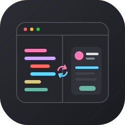

<p align="center">
  
</p>

# PreviewsMCP

<p>
  A standalone SwiftUI preview host for humans and AI agents.<br>
  Run, snapshot, and interact with <code>#Preview</code> blocks from the command line or over <a href="https://modelcontextprotocol.io/">MCP</a> — no Xcode process required.
</p>

## Quickstart

```bash
brew tap obj-p/tap
brew install previewsmcp
previewsmcp MyView.swift
```

A live macOS preview window opens. Edit the source file and the window hot-reloads.

> Want to build from source instead? See [From source](#from-source).

## Why PreviewsMCP?

PreviewsMCP JIT-compiles your `#Preview` closure and links it into a real app process (macOS `NSApplication` or iOS simulator `UIApplication`) with hot-reload — driven entirely from the command line or over MCP. No Xcode process required.

That makes it a standalone, extensible preview workflow:

- **CLI and MCP-native** — preview, snapshot, and iterate from the terminal or let an AI agent drive the loop
- **Hot-reload** — edit a file, see changes immediately, with `@State` preserved across literal edits
- **Trait and variant sweeps** — render one preview across color schemes, dynamic type sizes, locales, and layout directions in a single call
- **iOS interaction** — walk the accessibility tree and inject taps/swipes through an in-simulator touch bridge
- **Build system flexible** — works with **SPM**, **Xcode projects** (`.xcodeproj` / `.xcworkspace`), and **Bazel**

### Solving the Xcode preview sandbox problem

Xcode previews run your code inside Apple's opaque preview agent, so you can't run your own initialization. `FirebaseApp.configure()`, font registration, auth, and DI containers have nowhere to go. Teams work around this with **micro apps** — standalone targets that render one feature with controlled dependencies — and pay a steady maintenance tax in extra targets, schemes, and mocks. (Airbnb's dev apps drive over half of local iOS builds; Point-Free's isowords ships 9 preview apps.)

PreviewsMCP hosts your preview in its own app process, so you can extend it. The [setup plugin](Sources/PreviewsSetupKit/PreviewSetup.swift) is the hook: `setUp()` runs once per session (SDK init, auth, fonts, DI) and `wrap()` surrounds every render (themes, environment values). It's the micro app's dependency layer as a reusable framework, with no separate target to maintain.

## Installation

### Homebrew

```bash
brew tap obj-p/tap
brew install previewsmcp
```

### From source

```bash
git clone https://github.com/obj-p/PreviewsMCP.git
cd PreviewsMCP
brew install bazelisk
bazel build //previewsmcp/cli:previewsmcp   # first build compiles the LLVM JIT artifacts from source (~3-4 min)
```

The binary is at `bazel-bin/previewsmcp/cli/previewsmcp`, or run it through the `scripts/previewsmcp` wrapper. Bazel builds the LLVM JIT artifacts hermetically, so there are no helper scripts or host toolchain to install.

### Requirements

- macOS 14+
- Apple Silicon
- Xcode 26.2 to build from source (the Bazel build pins `--xcode_version=26.2`)
- An iOS 26 simulator for iOS support (the iOS preview host requires the iOS 26 scene-hosting runtime)
- [bazelisk](https://github.com/bazelbuild/bazelisk) to build from source (`brew install bazelisk`)

## Capabilities

- **Live previews** — hot-reload SwiftUI on macOS or a real iOS simulator, preserving `@State` where it can.
- **Variant & trait sweeps** — render one preview across many trait combinations (`colorScheme`, `dynamicTypeSize`, `locale`, `layoutDirection`, `legibilityWeight`) in a single call, with presets for light/dark, `xSmall`–`accessibility5`, `rtl`, `ltr`, and `boldText`.
- **Multi-preview selection** — `#Preview` macros and legacy `PreviewProvider`, with mid-session switching.
- **iOS interaction** — walk the accessibility tree and inject taps/swipes through an in-simulator touch bridge.
- **Setup plugin** — one-time SDK init, auth, and DI registration via `setUp()`, per-render theme/environment wrapping via `wrap()`. See the [full integration guide](docs/setup-plugin.md).
- **Project config** — `.previewsmcp.json` for per-project defaults (platform, device, traits, quality, setup target).

## Usage

### CLI

Every CLI subcommand talks to a background daemon that auto-starts on first use, so there is no lifecycle to manage (see [Daemon model](#daemon-model)).

```bash
previewsmcp help                   # top-level overview
previewsmcp help <subcommand>      # full options for any command
```

#### Previewing

```bash
previewsmcp MyView.swift                           # live macOS preview window
previewsmcp MyView.swift --platform ios            # iOS simulator
previewsmcp run MyView.swift --detach              # start in background, print session ID
```

#### Snapshotting

```bash
previewsmcp snapshot MyView.swift -o preview.png   # one-shot screenshot
previewsmcp variants MyView.swift \
  --variant light --variant dark -o ./shots         # multi-trait sweep
```

If a session is already running for the target file, `snapshot` and `variants` reuse it (fast — no recompile) and fall back to an ephemeral session otherwise.

#### Inspecting and interacting (iOS)

```bash
previewsmcp elements                               # dump accessibility tree as JSON
previewsmcp touch 120 200                           # tap at (120, 200)
previewsmcp touch 40 300 --to-x 300 --to-y 300     # swipe
```

#### Session management

```bash
previewsmcp configure --color-scheme dark           # change traits on a live session
previewsmcp switch 1                                # switch to the 2nd #Preview block
previewsmcp stop                                    # close the sole running session
previewsmcp stop --all                              # close every session
```

Commands that target a session resolve it automatically: `--session <uuid>` > `--file <path>` > the sole running session.

#### Enumeration and diagnostics

```bash
previewsmcp list MyView.swift                       # enumerate #Preview blocks
previewsmcp simulators                              # list available iOS simulators
previewsmcp status                                  # daemon alive?
previewsmcp logs -f                                 # stream the daemon log (see Debugging)
previewsmcp kill-daemon                             # stop the daemon process
```

#### Structured output

Read-oriented commands (`run --detach`, `snapshot`, `variants`, `list`, `status`, `simulators`, `elements`) support `--json` for scripts and agent consumption:

```bash
previewsmcp run MyView.swift --detach --json | jq .sessionID
previewsmcp simulators --json | jq '.simulators[] | select(.state == "Booted")'
```

### Project config

Drop a `.previewsmcp.json` at your project root to set defaults for every CLI command and MCP tool call (see [`examples/.previewsmcp.json`](examples/.previewsmcp.json) for the canonical shape):

```json
{
  "platform": "ios",
  "device": "iPhone 16 Pro",
  "traits": { "colorScheme": "dark", "locale": "en" }
}
```

Explicit CLI/MCP parameters override config values. The config is auto-discovered by walking up from the source file directory.

### MCP server

Add to your agent's MCP config — same `mcpServers` shape whether it lands in `.mcp.json` (Claude Code), `~/.cursor/mcp.json` (Cursor), `.vscode/mcp.json` (VS Code), or `claude_desktop_config.json` (Claude Desktop):

```json
{
  "mcpServers": {
    "previews": {
      "command": "/path/to/previewsmcp",
      "args": ["serve"]
    }
  }
}
```

Once connected, ask your agent *"what `previews` tools are available?"* — it will describe them directly from the server's registered schemas, including snapshotting, variant capture, accessibility-tree inspection, and touch injection.

### Daemon model

The CLI uses an auto-started background daemon that manages preview sessions. On first CLI invocation, `previewsmcp serve --daemon` launches in the background and listens on `~/.previewsmcp/serve.sock`. Subsequent commands connect to the existing daemon — no cold start. The daemon stays alive until explicitly killed (`previewsmcp kill-daemon`) or the machine reboots.

- `previewsmcp status` — check if the daemon is running and its PID.
- `previewsmcp kill-daemon` — stop the daemon and clean up the socket.
- Sessions persist across CLI invocations. `run --detach` starts one, `stop` closes it, and `configure` / `switch` / `snapshot` / `elements` / `touch` operate on it.


## Debugging

When a command appears stuck — most commonly `run` during an iOS host build — there are two places to look:

1. **The CLI's own stderr.** The daemon forwards a progress message for each build phase (`detecting project`, `building agent app`, `booting simulator`, …). The last phase printed is where it's stuck.
2. **The daemon log.** Daemon stderr goes to `~/.previewsmcp/serve.log`, which captures startup failures and anything logged outside an active command. Stream it in a second terminal:

   ```bash
   previewsmcp logs -f                       # follow new lines
   previewsmcp logs -n 200                   # snapshot the last 200 lines
   # or read the file directly:
   tail -F ~/.previewsmcp/serve.log
   ```

Other levers:

- `previewsmcp status --json` — confirm the daemon is still alive (`running` / `transitional` / `stopped`) while a command is blocked.
- `previewsmcp kill-daemon`, then re-run — gives a clean daemon and a fresh `serve.log`.
- `PREVIEWSMCP_SOCKET_DIR=/tmp/dbg previewsmcp …` — relocates the socket, PID, and log files to isolate a debug run from your main daemon. Set it on every invocation (including `logs`) so they share the dir.
- Subprocess failures (`xcodebuild`, `swiftc`, `codesign`) include their stderr in the error. A hang won't, so if a build phase is stuck check for a live process: `ps -ef | grep -E 'xcodebuild|swiftc'`.


