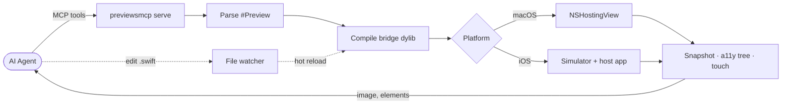

# Architecture



Parse the target `.swift` file, compile a bridge dylib, render it in an `NSHostingView` or a booted iOS simulator, and hand snapshots or the accessibility tree back to whoever asked. A file watcher hot-reloads edits in place, preserving `@State` where it can. Both `#Preview` macros and legacy `PreviewProvider` types are supported.

## Module layout

```
Sources/
├── SimulatorBridge/     ObjC — runtime-loads CoreSimulator.framework
├── PreviewsCore/        Platform-agnostic: parser, compiler, bridge gen, differ, watcher
├── PreviewsMacOS/       macOS host: NSApplication + NSWindow + snapshot
├── PreviewsIOS/         iOS simulator: SimulatorManager, IOSHostBuilder, IOSPreviewSession
├── PreviewsCLI/         CLI (ArgumentParser) + MCP server (swift-sdk)
└── PreviewsSetupKit/    Zero-dependency setup-plugin protocol (PreviewSetup)
```

- **PreviewsCore** has no platform-specific dependencies (no AppKit, no CoreSimulator).
- **SimulatorBridge** is ObjC because it uses `objc_lookUpClass` / protocol casts for private API access.
- **PreviewsIOS** depends on `SimulatorBridge`; touch injection runs in-app via the Hammer approach (`IOHIDEventCreateDigitizerFingerEvent` + `BKSHIDEventSetDigitizerInfo` + `UIApplication._enqueueHIDEvent:`).
- **IOSHostAppSource.swift** holds the iOS host app as an embedded string, compiled at runtime by `IOSHostBuilder` for `arm64-apple-ios-simulator`.

## Further reading

- [`docs/build-system-integration.md`](build-system-integration.md) — how SPM / Xcode / Bazel projects are detected and built.
- [`docs/communication-protocol.md`](communication-protocol.md) — wire protocol between the host and the in-simulator app.
- [`docs/reverse-engineering.md`](reverse-engineering.md) — notes on the private framework surface used for rendering and touch injection.
