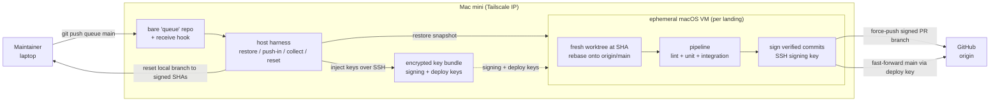
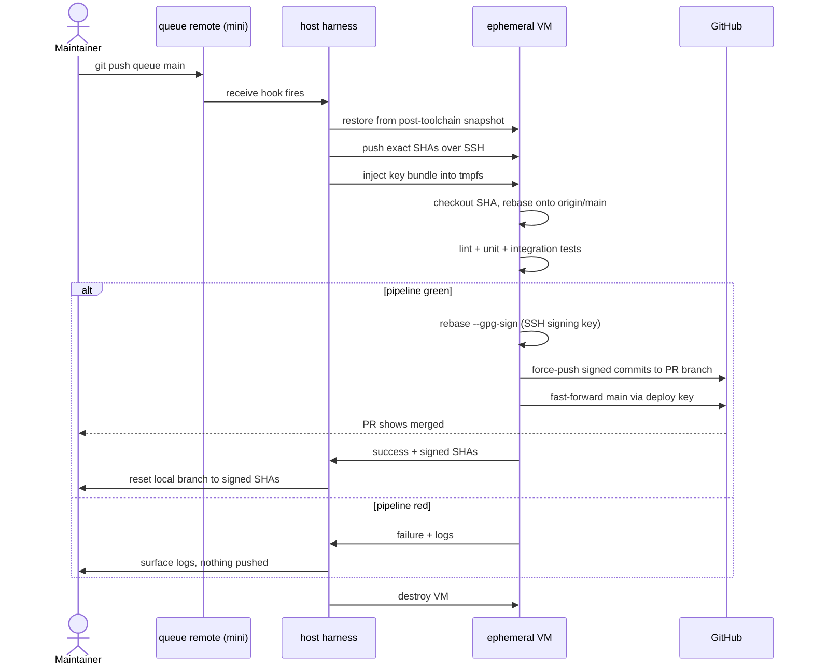
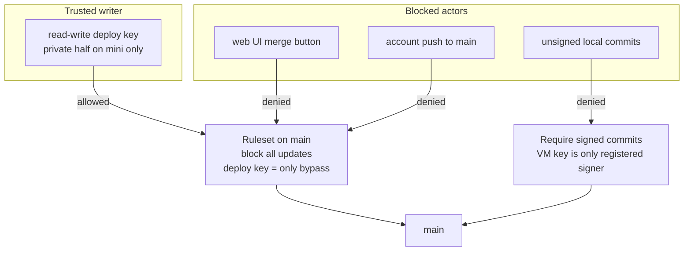
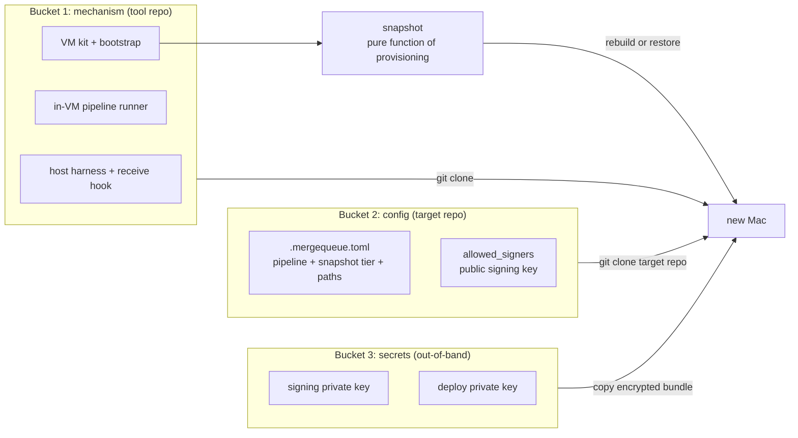
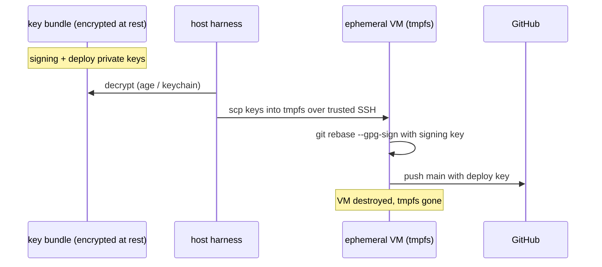
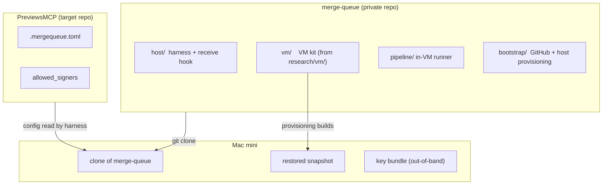

# Local merge queue — implementation plan

This plan supersedes the design sketch in
[`local-merge-queue.md`](local-merge-queue.md). It keeps that design's core
(a no-mistakes style proxy remote, a clean-room VM that signs on green, a
GitHub ruleset that makes the VM the only writer of `main`) and resolves the
three questions that design left open: where the host runs, where the signing
keys live, and how the whole system moves between repos and between Macs.

## Summary

We replace GitHub Actions entirely. There is no CI on GitHub in this model.
The only thing that can update `main` is a Mac mini running a single-worker
merge queue, reachable over Tailscale. To land a change you push its branch to
a `queue` remote on the mini. The mini restores a clean macOS VM from a
snapshot, rebases the branch onto current `origin/main`, runs the documented
merge bar (lint, unit tests, example integration tests) in that exact
post-merge state, signs the verified commits with a key that lives only on the
mini, and fast-forwards `main` through a deploy key that a branch ruleset names
as the sole bypass actor. Only the maintainer can push to the queue, so a fork
PR carries no automated signal until the maintainer personally runs it through.

The whole system is built to move. The mechanism lives in its own private repo
(`merge-queue`). A target repo like PreviewsMCP carries only a small config
file and a checked-in public key. The signing and deploy keys are an external
encrypted bundle, not baked into the VM image, so the snapshot stays a pure
function of provisioning. Moving to a new Mac, or onboarding a second repo,
both reduce to one fixed script: clone the tool repo, restore or rebuild the
snapshot, drop the key bundle, run bootstrap.

## Goals and non-goals

Goals.

- Make the merge bar enforceable, not honor-system. Unverified code cannot
  reach `main`.
- Run verification on hardware we control, with consistent VM images.
- Be portable across three axes: repo to repo, Mac to Mac, and key rotation.
- Need zero manual steps to rehost. Everything is code, config, or one
  backed-up secret bundle.

Non-goals.

- Defending against a determined attacker with physical access to the mini.
  The threat is workflow slop, not intrusion. See the threat model.
- Multi-worker parallelism. The queue is single-worker by design. Batching is
  a later option, not part of this plan.
- Running any check on GitHub's infrastructure. Actions is disabled.

## The three portability axes

The design must survive three different kinds of move. Each maps to a concrete
test.

1. **Repo to repo.** Onboarding a new repo edits only a config file and runs
   bootstrap. If it ever requires editing harness code, repo-specific logic
   leaked into the mechanism.
2. **Mac to Mac.** Rehosting copies the tool repo, the snapshot, and the key
   bundle, then runs bootstrap. If it requires remembering a manual tweak made
   on the old Mac, the host was a pet, not cattle.
3. **Key rotation.** Minting a new key pair updates `allowed_signers` and the
   GitHub deploy key through bootstrap, with no snapshot rebuild. If rotation
   forces a snapshot rebuild, identity is welded to the wrong artifact.

## Architecture

### Topology



The mini runs three long-lived things: the bare `queue` remote whose receive
hook starts a landing, the host harness that drives the VM lifecycle, and the
encrypted key bundle at rest. The VM is created per landing and destroyed
after. GitHub never connects inward. The mini dials out for the two pushes.

### Landing sequence



### Trust boundary and the GitHub gate



Two GitHub layers hold the door, neither using Actions. The ruleset on `main`
blocks every update and names the deploy key as the only bypass actor, which
also kills the web merge button. Require-signed-commits is a free second layer
because the VM key is the only signer registered on the account. The deploy
key is the high-value secret. It is what can actually push `main`. The signing
key is only attestation, so a stolen signing key still cannot land anything.

## State model and portability

Every piece of host state falls into one of three buckets. Bucket four, a
manual step, is the failure case the design forbids.



Bucket 1 arrives by cloning the tool repo. Bucket 2 arrives by cloning the
target repo. Bucket 3 is the one irreducible artifact you back up once and copy
by hand. The snapshot is regenerable from bucket 1's provisioning, so it is not
a secret and not config. Keeping identity out of the snapshot is what makes
this clean.

## Key-location decision: external injected bundle

We do not let keys be born inside the snapshot. The keys live in an encrypted
bundle on the mini and are injected into the ephemeral VM at the start of each
landing. The VM uses them, then is destroyed.



Why this beats the alternatives.

- **Born in VM (the old design).** Rehosting means copying the whole snapshot
  so the keys ride along, or rebuilding the snapshot and minting new keys. That
  welds identity to the heaviest artifact and makes "rebuild the snapshot"
  silently mean "change identity." Rejected.
- **External injected bundle (chosen).** Rehost copies one small encrypted
  file. The snapshot rebuilds freely with no identity inside. Rotation is
  cheap. Bootstrap re-registers the public halves through the GitHub API and
  the `allowed_signers` commit.
- **Hardware-bound (Secure Enclave or YubiKey).** Non-extractable keys cannot
  move to another Mac, so every rehost forces fresh enrollment. This is the
  opposite of the portability goal. Reserved as a future option for the deploy
  key only, if its value ever justifies accepting manual rehosting.

Pitfalls to hold.

- Encrypt the bundle at rest. A plaintext key on the mini means a stolen or
  resold mini can push `main`. Cheap to do, so do it.
- The bundle is neither code nor config. Never commit it to the tool repo or
  the target repo.
- Inject keys onto tmpfs and never into any snapshot the VM might save. The
  host-to-VM SSH channel already carries the SHAs, so the trust boundary does
  not widen.

## Repo and host layout



The VM kit moves out of `research/vm/` and into the tool repo, consistent with
the existing intent to keep that kit cleanly separable. PreviewsMCP keeps only
`.mergequeue.toml` (pipeline commands, snapshot tier name, Tailnet address,
paths) and `allowed_signers` (the public signing key, so anyone can verify
`main` locally).

## Bootstrap runbook

`bootstrap` is idempotent and reads `.mergequeue.toml`. Onboarding a repo runs
it once.

1. Register the deploy key public half on the target repo through the GitHub
   API. Ensure it is the only read-write deploy key, since the ruleset bypass
   covers all deploy keys.
2. Create or update the ruleset on `main`: block all updates, deploy key as
   the sole bypass actor.
3. Enable require-signed-commits as the second layer.
4. Commit `allowed_signers` with the public signing key.
5. Disable the GitHub Actions workflows in the target repo.
6. Create the bare `queue` remote on the mini and install the receive hook.

Verify bootstrap: an account push directly to `main` is rejected, the web merge
button is blocked, and a VM landing succeeds and shows the PR merged.

## Rehost runbook

Moving the queue from one Mac to another.

1. Provision the new Mac with the tool repo's VM kit automation.
2. Restore the snapshot, or rebuild it from provisioning.
3. Copy the encrypted key bundle to the new Mac.
4. Run bootstrap. It re-registers identities on GitHub only if they changed.
5. Point the `queue` remote URL at the new Mac's Tailnet address.

Verify rehost: on the new Mac, land a known-good SHA and confirm
`git verify-commit` passes against the unchanged `allowed_signers`. No manual
step from the old Mac was needed.

## Threat model

The adversary is workflow slop. That is an agent or a hurried human pushing
unverified code to `main`, not a malicious attacker. The signing key sits on a
disk on the mini, so a determined human with access could extract it. That is
accepted. The VM boundary makes the lazy path impossible, which is what local
CI needs. GitHub's permission layer (deploy key plus ruleset) is what actually
holds the door. The signature is the audit trail. Encrypting the key bundle at
rest raises the bar on a stolen mini without changing this model.

## Implementation phases

Each phase has a single pass/fail check. Do not start the next phase until the
current check passes.

1. **VM pipeline.** Build the `post-toolchain` snapshot. Write the in-VM script
   that checks out a SHA, rebases onto `origin/main`, runs the pipeline, and
   signs on green using an injected key. Verify: a known-good SHA comes back
   signed, a known-bad SHA is rejected, and the key was injected at run, not
   baked into the snapshot.
2. **Key bundle and injection.** Create the encrypted bundle. Wire the harness
   to decrypt and inject onto tmpfs. Verify: delete the snapshot, rebuild from
   provisioning only, inject the bundle, run a landing, and the commit is
   signed under the same identity as before.
3. **Host harness.** Build the bare `queue` remote, receive hook, VM
   restore/push-in/collect, and local branch reset. Verify: an end-to-end
   landing on a scratch repo, driven entirely by `git push queue`.
4. **GitHub cutover.** Run bootstrap against PreviewsMCP: deploy key, ruleset,
   require-signed-commits, `allowed_signers`, disable Actions. Verify: account
   push to `main` rejected, web merge button blocked, VM landing shows the PR
   merged.
5. **Rehost drill.** Move the queue to a second Mac (or a fresh VM standing in
   for one) using only the rehost runbook. Verify: a landing succeeds with no
   manual step carried from the first host.

## Open questions

- Whether to bake warm SwiftPM and Bazel build caches into the snapshot for
  speed, at the cost of a less pristine environment.
- Per-push versus per-merge verification tiers. The full pipeline per landing
  is required. Whether feature-branch pushes get a cheaper advisory tier is
  open.
- Batching. The queue is single-worker. If landings ever back up, the harness
  can batch several approved branches into one VM run, Bors-style.
- Secret store choice for the bundle: an age-encrypted file versus the macOS
  keychain versus a small secrets manager.
- Snapshot transport on rehost: copy the multi-gigabyte bundle, or always
  rebuild from provisioning on the new host and accept the longer first run.
```
